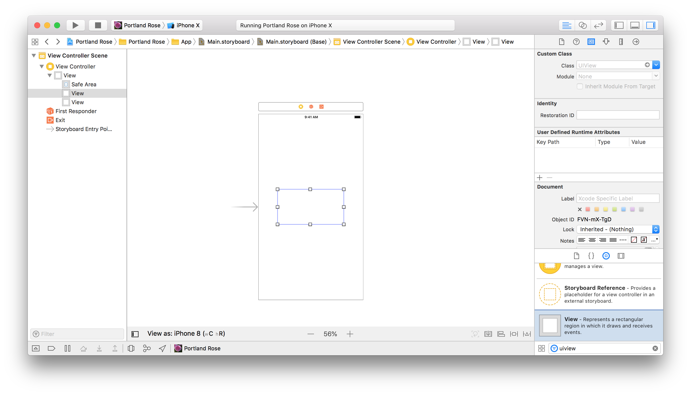
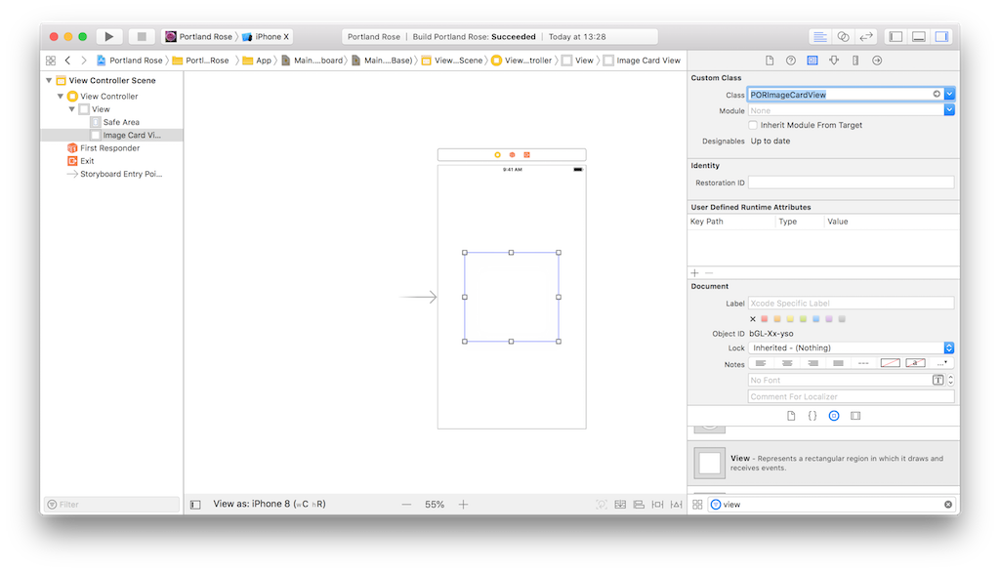
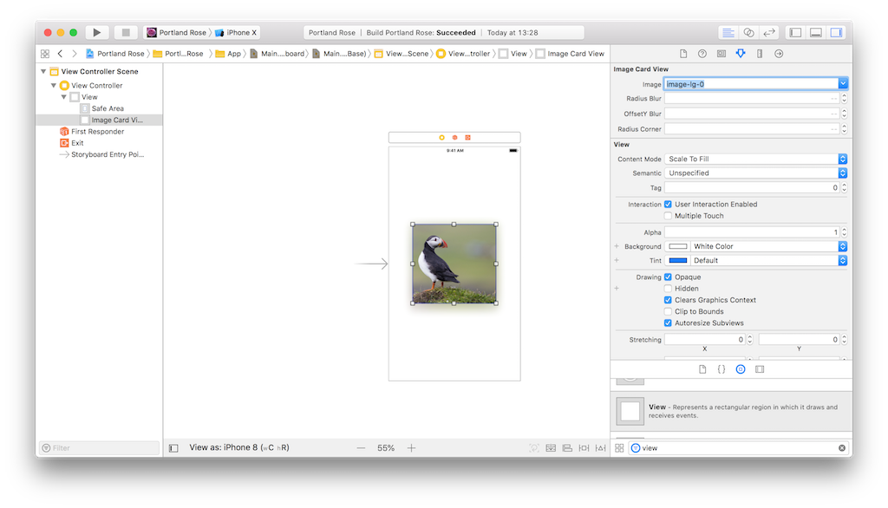

# Portland Rose


## Introduction

Portland Rose, named for the **[portland class](https://en.wikipedia.org/wiki/Garden_roses#Portland)** of rose, is the native iOS app for Compass Rose.

## Xcode Project Structure

```
.
|-- App
|   |-- Controllers
|   |-- Helpers
|   |-- Models
|   |-- Views
|   |   |-- LaunchScreen.storyboard
|   |-- AppDelegate.h
|   |-- AppDelegate.m
|   |-- Assets.xcassets
|   |-- Main.storyboard
|-- demo
|   |-- Helpers
|   |-- Mocks
|   |-- Models
|   |-- Views
|   |-- PORDemosViewController.h
|   |-- PORDemosViewController.m
|   |-- Demo.storyboard
|-- Config
|   |-- Info.plist
```

### App

`App` organizes Portland Rose's applicaiton components. 

* **Controllers** — The `Controllers` subdirectory contains the application's `ViewController`s.
* **Helpers** — The `Helpers` subdirectory contains Objective-C category source files and other helper classes used to assist the application's model, view, and controller classes.
* **Models** — The `Models` subdirectory contains the application's model classes.
* **Views** — The `views` subdirectory contains the application's view classes and `.xib` nib files.

### Demo

`Demo` contains view controllers and other components used to demo application components outside of the context of the app itself.

* **Helpers** - the `Helpers`subdirectory contains helper classes used for testing purposes
* **Mocks** - The `Mocks` subdirectory contains categories used to generate randomized instances of models for testing purposes
* **Models** — The `Models` subdirectory contains view controller classes designed to demo model classes.
* **Views** — The `Views` subdirectory contains view controller classes designed to demo specific view classes.
* **PORDemosViewController.m** and **PORDemosViewController.h** — These are the source files for the demo index scene.
* **Demo.storyboard** — `Demo.storyboard` is the interface builder for demo view controllers.

### Config

`Config` contains app configuration and build files, such as `info.plist`.

## Building

### Preprocessor Macros

* **Demo** — the `DEMO` preprocessor macro indicates whether or not the app should run in "Demo" mode. In "Demo" mode, `Demo.storyboard` is the root storyboard.

### Schemes

Portland Rose can be built using one of three different "schemes": Development, Staging, and Production. 

* **Development** — This scheme is used for building and testing individual application components. The `DEMO` preprocessor macro is set to `1`.
* **Staging** — this scheme is used for staging the application.
* **Production** — this scheme is used to build production-ready releases.

# Models

## Activity

* **Amount (minimum estimate)** — `amountMin` is the minimum estimated price for the activity.
* **Amount (Maximum Estimate)** — `amountMax` is the maximum estimated price for the activity.
* **Icon** – `icon` is an icon used to represent the activity.
* **title** — `title` is a descriptive title for the activity.
* **Location** — `location` is the activity's general location. See `PORLocation` documentation.

## Badge

Badges provide an at-a-glance summary of an itinerary.

* **Icon** — `icon` is the badge's visual representation.
* **Title** — `title` is the name of the badge.

## Itinerary

* **Activities** — `activities` is a list of all activities that are a part of this itinerary. See `PORActivity` for more information.
* **badges** — `badges` is a list of all badges associated with this itinerary. See `PORBadge` for more information.
* **Cost (Lower Estimate)** — `costLower` is the lower estimate for the itinerary's total cost.
* **Cost (Upper Estimate)** — `costUpper` is the upper estimate for the itinerary's total cost. 
* **duration** — `duration` is the duration estimate for the itinerary *in minutes*.
* **Main Image** — `imageMain` is the primary image associated with the itinerary. 
* **Secondary Images** – `imagesSecondary` is a list of secondary images associated with the itinerary.
* **Title** — `title` is this itinerary's display title. 


## Location

* **Title** — `title` is the name of the location, e.g. "Puffin Cafe" or "505 College Street".

# Helpers

## Palette

The `PORPalette` model stores Portland Rose's custom colors. These colors are organized by function (e.g. color for dividers) rather than by visual color (e.g. "red"). 

* **Background Color** — `colorBackground` contains the default background color used for the app's scenes and content views.
* **Divider Color** — `colorDivider` is the default color for the thin divider lines between views.
* **Primary Color** — `colorPrimary` is the primary theme color for 'branded' elements and prominent controls.
* **Secondary Color** — `colorSecondary` is a variant of `colorPrimary` used along with the former in gradients.
* **Text Color** — `colorText` is the default color of application text.
* **Text Color (Inverted)** — `colorTextInverted` is the default color for text displayed on a dark color background.
* **Text Color (Loud)** — `colorTextLoud` is the default color for emphasized text.
* **Text Color (Muted)** — `colorTextMuted` is the default color for subtle text.

### Usage

1. Import `"PORPalette.h"`
2. create a pointer to the shared `PORPalette` singleton: 
  ```objective-c
  PORPalette * palette = PORPalette.sharedPalette;
  ```
3. Access the palette's colors like this: 
  ```objective-c
  UIColor * color = palette.colorText;
  ```

### Customization

**Adding New Colors**

To add a new color by hex value and update one or more of the palette's color properties to use that new color:

1. Add the new color's hex value as a `static NSString *` in `PORPalette.m`
  ```objective-c
  // PORPalette.m
  static NSString * const HEX_NEW_COLOR = @"EAEAEA";
  ```
2. Update the `init` function to set one or more of the palette's color properties equal to the new color:
  ```objective-c
  - (id) init {
    if (self = [super init]){
      // ...
      _colorText = [UIColor colorWithHexString: HEX_NEW_COLOR];
    }
    return self;
  }
  ```

**Adding New Palette Color Properties**

Let's say you want to add a new palette color for all warning text. Here's how you would go about it:

1. Update `PORPalette.h` 
  ```objective-c
  // PORPalette.h
  // ...
  @interface PORPalette : NSObject
  // ...
  @property UIColor * colorTextWarning;
  // ...
  ```
2. Update `init`:
  ```objective-c
  // PORPalette.m
  - (id) init {
    if (self = [super init]){
      // ...
      _colorTextWarning = [UIColor colorWithHexString: HEX_THULIAN_PINK];
    }
    return self;
  }
  ```

## TypeLibrary

The `PORTypeLibrary` model organizes the application's fonts by function.

* **Body Font** — `fontBody` is the default font for body text.
* **Headline Font** — `fontHeadline` is the default font for headline text, viz. a title that is placed among body text (cf. the title of a book as it appears on the title page and the title of a chapter as it appears on a page alongside regular text).
* **Subtitle Font** — `fontSubtitle` is the default font for subtitle text, e.g. the author's name on the title page of a book or a "Part One" page.
* **Title Font** — `fontTitle` is the default font for title text, e.g. the title of a book as it appears on the title page.

### Usage

1. Import `"PORTypeLibrary.h"`
2. Create a pointer to the shared `PORTypeLibrary` singleton: 
  ```objective-c
  PORTypeLibrary * typeLibrary = PORTypeLibrary.sharedTypeLibrary;
  ```
3. Access the the library's fonts like this: 
  ```objective-c
  UIFont * font = typeLibrary.fontBody;
  ```
# Views

## ActionButtonView

`PORActionButtonView` renders a text button with a colored background and drop shadow.

### Usage

1. First, drag a `UIView` to the interface builder.
   
2. set the view's *position* constraints (do not set size constraints, as 
   `PORActionButtonView` uses intrinsic size).
   
3. Set the view's class to `PORActionButtonView`.
   
4. To handle user taps, create an outlet for the "Touch Up Inside" event

### Customization


`PORActionButtonView` can be customized programmatically or via the interface builder.

* **Background Color One** — `colorBackgroundOne` sets the first background gradient color
* **Background Color Two** — `colorbackgroundTwo` sets the second background gradient color
* **Label Color** — `colorLabel` sets the color of the button's label
* **text** — `text` sets the button's label text

## ActivityCellView

`PORActivityCellView` displays an activity outline.

### Usage

1. Ensure the parent `UITAbleView` has automatic cell sizing enabled. For better performance, also ensure that its row height estimate is ~300.
2. Update the `UITableView`'s data source methods. In the below example, `_activities` is an `NSArray <PORActivity *> *`.:
```objective-c
- (UITableViewCell *) tableView:(UITableView *)tableView cellForRowAtIndexPath:(NSIndexPath *)indexPath{
  UITableViewCell * cell;
 
  // Dequeue a reusable cell 
  cell = [tableView dequeueReusableCellWithIdentifier:[PORActivityCellView reuseIdentifier]];
  // if necessary, register the nib and try to dequeue again 
  if (!cell){
    [tableView registerNib:[UINib nibWithNibName: [PORActivityCellView nibName] bundle: nil] forCellReuseIdentifier:[PORActivityCellView reuseIdentifier]];
    cell = [tableView dequeueReusableCellWithIdentifier:[PORActivityCellView reuseIdentifier]];
  }
  // configure the cell by setting its `activity` property
  [((PORActivityCellView *) cell) setActivity: _activities[indexPath.row]];

  return cell;
}
```

## Floating Action Button View

`PORFloatingActionButtonView` renders a button with an icon image and a 1:1 aspect ratio.

### Usage

`PORFloatingActionButtonView` can be customized programmatically or via the interface builder.

* **Background Color One** — `colorBackgroundOne` sets the first background gradient color
* **Background Color Two** — `colorbackgroundTwo` sets the second background gradient color
* **Label Color** — `colorLabel` sets the color of the button's label
* **Tint Color** — `colorTint` sets the tint color of the button's image
* **Image** — `image` is the image to be displayed.
* **radius** — `radius` sets the button's intrinsic size

## ImageCardView

`PORImageCardView` displays a single image on an attractive card. 

### Usage

1. First, create a `UIview` instance either in a `.xib` file or in
   a storyboard interface builder.
2. Select the `UIView` instance and Set the `UIView`'s class to 
   `PORImageCardView` in the Identity Inspector 
   
3. Set the `PORImageCardView`'s "Image" property in the Attributesi
   Inspector, or set the image at runtime by creating a reference
   outlet for the `PORImageCardView` instance and calling 
   `setImage:`
   

### Customization

`PORImageCardView` can be customized either programmatically or via the interface builder. `PORImageCardView` can be customized in these ways:

* **Blur Radius** — `setRadiusBlur:` sets the image card's shadow
  radius
* **Blur Offset (Y)** — `setOffsetYBlur:` sets the vertical offset of the image card's shadow 
* **Corner Radius** — `setRadiusCorner:` sets the image card's corner radius


## ImageCarouselView

`PORImageCarouselView` renders a horizontal carousel containing image cards (see `PORImageCardView`). 

### Usage

1. Add a `UIView` to the interface builder and set its class to `PORImageCarouselView`.
2. Create a reference outlet for it.
   ```objective-c
   @property (weak, nonatomic) IBOutlet PORImageCarouselView *carousel;
   ```
3. set the carousel's images: 
   ```objective-c
   // ExampleViewController.m
   // ...
   - (void) viewDidLoad{
     [super viewDidLoad];
     NSArray <UIImage *> * images = @[[UIImage imageNamed: @"example-image"]];
     [_carousel setImages: images];
   }
   ```
4. when a user changes the current image displayed in the carousel, the carousel notifies its delegate using the `imageCarouselView:didChangeIndex:` protocol method. To handle this, first ensure that the parent view or view controller conforms to the `PORImageCarouselViewDelegate` protocol:
```objective-c
// ExampleViewController.h
// ...
@interface ExampleViewController : UIViewController <PORImageCarouselDelegate> 
// ...
```
```objective-c
// ExampleViewController.m
// ...
- (void) imageCarouselView: (PORImageCarouselView *) carouselView didChangeIndex: (NSUInteger) index{
  NSLog(@"%lu", index);
}
// ...
``` 
Next, set the `PORImageCarouselView`'s `delegate` property:
```objective-c
// ExampleViewController.m
// ...
- (void) viewDidLoad {
  [super viewDidLoad];
  [_carousel setDelegate: self];
  // ...
}
```

## ItineraryHeaderCellView

The `PORItineraryHeaderCellView` class displays an itinerary title along with cost / duration estimates and a carousel of itinerary images.

### Usage

1. Configure the parent table view or table view controller's `cellForRowAtIndexPath:` method:
```objective-c
- (UITableViewCell *)tableView:(UITableView *)tableView cellForRowAtIndexPath:(NSIndexPath *)indexPath{
  UITableViewCell * cell;
  
  // Try to dequeue the cell without registering a nib / reuse id 
  cell = [tableView dequeueReusableCellWithIdentifier: [PORItineraryHeaderCellView reuseIdentifier]];
  // If that fails, register the nib / reuse id and try again
  if (!cell){
    [tableView registerNib:[UINib nibWithNibName:[PORItineraryHeaderCellView nibName] bundle:nil] forCellReuseIdentifier:[PORItineraryHeaderCellView reuseIdentifier]];
    cell = [tableView dequeueReusableCellWithIdentifier: [PORItineraryHeaderCellView reuseIdentifier]];
  }
  // Set the cell's `_itinerary` property 
  [((PORItineraryHeaderCellView *) cell) setItinerary: _itineraries[indexPath.row]];
  
  return cell;
}
```

## LabeledIconView

The `PORLabeledIconView` displays a horizontal stack containing a single image icon and a text label.

### Usage

A `PORLabeledIconView` can be added directly to the interface builder by adding a `UIView` and setting its class to `PORLabeledIconView`.

* **Icon** — `icon` sets the icon.
* **Text** — `text` sets the label's text. *Note: If `text` is not given, or if it contains only whitespace characters, the `PORLabeledIconView` will not be displayed at all (`hidden == YES`)*.

### Customization

The `PORLabeledIconView` class can be customized in these ways:

* **Color** — `color` sets the text color and icon tint color. `color` defaults to the `PORPalette`'s default text color.
* **Font** — `font` sets the label's font; it defaults to `PORTypeLibrary`'s default body font.
* **Stack Spacing** – `spacingStack` sets the spacing between the icon and its label.


## NavigationController

The `PORNavigationController` class renders a customized navigation bar.

### Usage

In the interface builder, set the navigation controller's class to `PORNavigationController`; all child view controllers will display the customized navigation bar.

## TabBarView

`PORTabBarView` renders a custom tab bar control that can be used with a `UITabBarController`. 


### Usage

1. in the storyboard, drag a `UIView` onto the bar above a tab bar controller scene.
  
2. Set the `UIView`'s class to `PORTabBarView`.
3. Create reference outlets in the tab bar controller `.m` file for this `PORTabBarView` *as well as* for the built-in `UITabBar` .
4. In the tab bar controller's `viewDidLoad` method, add the `PORTabBarView` as a subview.
  ```objective-c
  - (void) viewDidLoad {
    // ...
   [self.view addSubview: customTabBarView];
  }
  ```
5. In the tab bar controller's `viewDidLayoutSubviews` method, set the `PORTabBarView`'s frame equal to the `UITabBar`'s frame.
  ```objective-c
  - (void) viewDidLayoutSubviews { 
    // ...
    [self.customTabBarView setFrame: self.systemTabBarView.frame];
  } 
  ``` 
6. In the storyboard, set the `UITabBar`'s `Hidden` property to `YES`.
7. drag the `PORTabBarView`'s "Value Changed" event to an action outlet in the tab bar controller. There, set the tab bar controller's `selectedIndex` property to equal the `PORTabBarView`'s `selectedIndex` property. 
  ```objective-c
  - (IBAction) handleTabBarSelectedIndexChange: (PORTabBarView *) tabBarView  {
    self.selectedIndex = tabBarView.selectedIndex;
  }
  ```
 
### Customization

**Changing A Button Image**

1. Add a new icon image to `Assets.xcassets`. It must be 100px in size and have an `@2x` suffix.
2. In `PORTabBarView.xib`, change the image of the corresponding button

**Adding A Button**

1. In `PORTabBarView.xib`, copy and paste one of the button views; *this ensures that the necessary constraints are copied as well.* 
2. Follow the steps above for changing the new button's image.

## ItinerarySummaryCellView

`PORItinerarySummaryCellView` is a subclass of `UITableCellView`. It is responsible for rendering a single `PORItinerarySummaryView` and for notifying its delegate of user interactions with the same.

### Usage

Follow the same steps you would follow to use any other custom `UITableCellView` subclass, then:

1. Ensure that the table view uses **[self-sizing table view cells](https://developer.apple.com/library/content/documentation/UserExperience/Conceptual/AutolayoutPG/WorkingwithSelf-SizingTableViewCells.html)**.
2. Set the table view's `tableView:cellForRowAtIndexPath:` method:
   ```objective-c
   ((PORItinerarySummaryCellView *) cell).index = indexPath.row;
   ``` 
3. Add the `<PORItinerarySummaryCellViewDelegate>` protocol to the table view:
   ```objective-c
   // ExampleTableView.h
   @interface @interface ExampleTableView : UITableViewController <PORItinerarySummaryCellViewDelegate>
   @end
   ```
   and implement its methods:
   ```objective-c
   // ExampleTableView.m
   //...
   - (void) didSelectItineraryAtIndex:(NSUInteger)index{
     NSLog(@"Did select itinerary #%lu", (unsigned long) index);
   }
   //...
   ```

### Customization

To customize the cell's `PORItinerarySummaryView` appearance, update its parent table view's `tableView:cellForItemAtIndexPath:` method:

```objective-c
PORItinerary * itinerary = [[PORItinerary alloc] init];
PORItinerarySummaryView * isv = ((PorItinerarySummaryCellView *) cell).itinerary = itinerary;
```

## ItinerarySummaryView

The `PORItinerarySummaryView` renders a summary of a date itinerary.

### Usage

A `PORItinerarySummaryView` can be instantiated either via the interface builder or programmatically.

### Customization

These attributes may be customized:

* **Cost (Lower Bound)** — `costLower` is the lower bound of the itinerary's total cost estimate
* **cost (upper bound)** — `costUpper` is the upper bound of the itinerary's total cost estimate
* **Duration** — `curation` is the estimated itinerary duration *in minutes*.
* **icson** — `icons` is an array of icon images to display
* **Image** — `image` is the itinerary's primary image
* **Title** — `title` is the itinerary title
